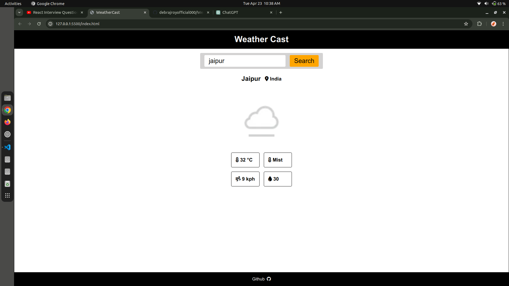
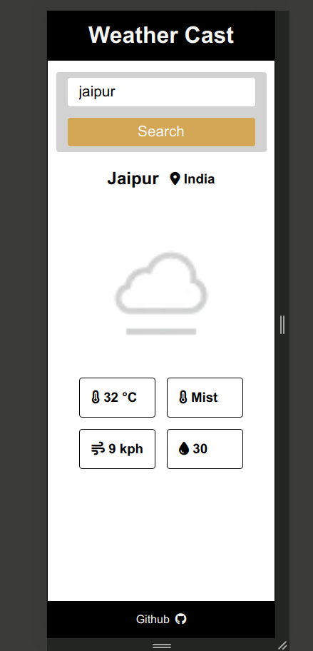

# WeatherCast

WeatherCast is a simple weather application that provides current weather information for any location around the world. It allows users to search for weather information by city name and provides details such as temperature, humidity, wind speed, and weather description.

## Features

- **Current Weather:** Get the current weather conditions for any location.
- **Search by City:** Search for weather information using the city name.
- **Clean UI:** Simple and clean user interface for easy navigation.

## Technologies Used

- HTML
- CSS
- JavaScript
- OpenWeatherMap API

## Screenshots




## Usage

1. Clone the repository:

```bash
git clone https://github.com/debrajroyofficial000/WeatherCast.git
```

2. Open `index.html` in your web browser.

3. Enter the name of the city for which you want to get weather information.
